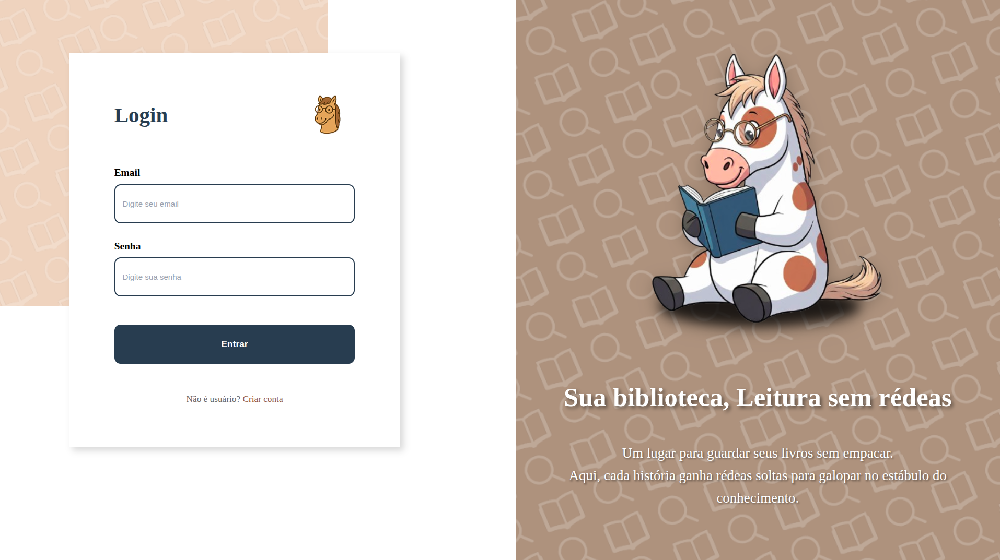
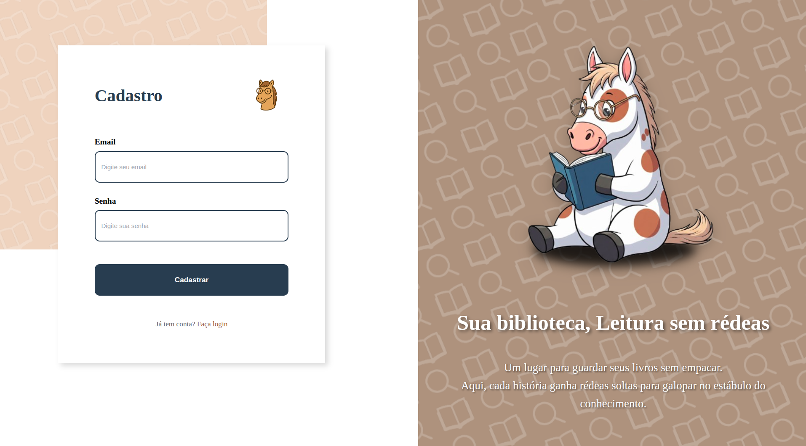
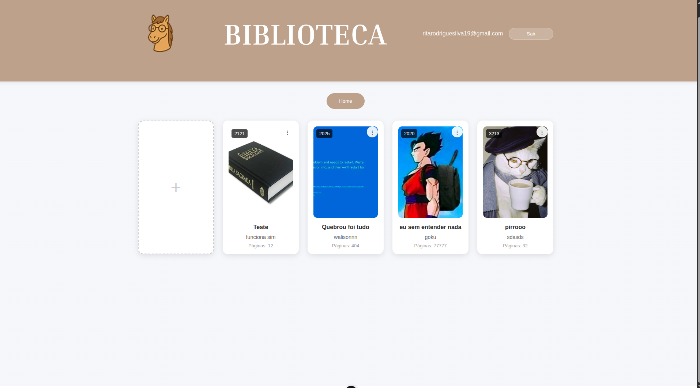
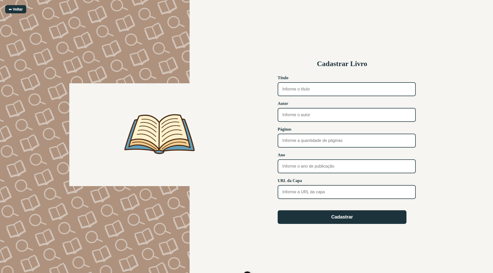
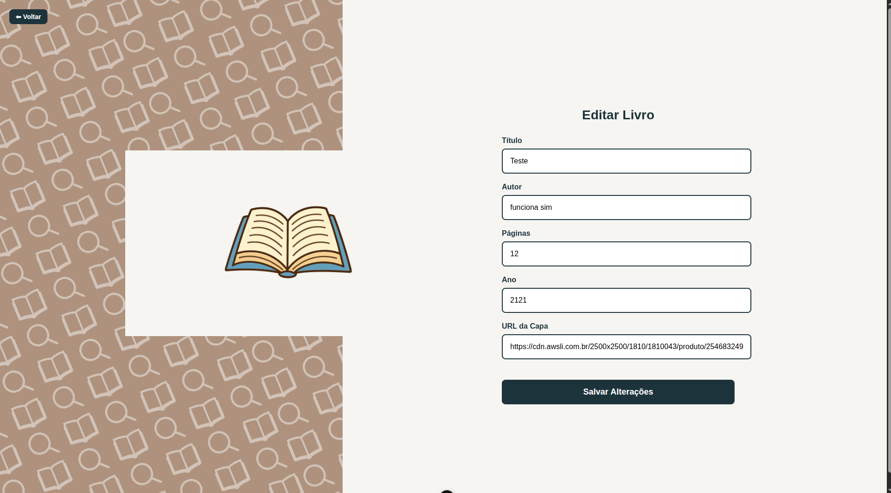

# 📚 CRUD Library - EquiBook

Uma aplicação web completa para gerenciamento de biblioteca pessoal, desenvolvida com Vue.js 3 no frontend e Node.js/Express no backend, utilizando Supabase como banco de dados.

[](https://youtu.be/KbMZGc9SPq4?si=xzRkNph9itY5TnmI)


## 🎯 Funcionalidades

- **Autenticação de Usuários**: Sistema completo de login e cadastro
- **CRUD de Livros**: Criar, visualizar, editar e excluir livros da biblioteca
- **Interface Responsiva**: Design adaptável para desktop e mobile
- **Gerenciamento de Capas**: Suporte a URLs de imagens para capas dos livros

## 📱 Interface da Aplicação

### 🔐 Autenticação

<table>
  <tr>
    <td align="center" width="50%">
      <h4>🚪 Tela de Login</h4>
      
      <br><em>Interface de entrada com design limpo e intuitivo</em>
    </td>
    <td align="center" width="50%">
      <h4>📝 Tela de Cadastro</h4>
      
      <br><em>Formulário de registro para novos usuários</em>
    </td>
  </tr>
</table>

### 📖 Gerenciamento de Livros

<div align="center">
  <h4>🏠 Dashboard Principal</h4>
  
  <br><em>Visualização em grid da biblioteca pessoal com opções de gerenciamento</em>
</div>

<table>
  <tr>
    <td align="center" width="50%">
      <h4>➕ Cadastrar Livro</h4>
      
      <br><em>Formulário completo para adicionar novos livros</em>
    </td>
    <td align="center" width="50%">
      <h4>✏️ Editar Livro</h4>
      
      <br><em>Interface para atualização de informações dos livros</em>
    </td>
  </tr>
</table>

---

## 🏗️ Arquitetura do Projeto

```
CRUD-Library/
├── client/                    # Frontend Vue.js
│   ├── public/               # Arquivos públicos
│   ├── src/
│   │   ├── assets/          # Imagens e recursos
│   │   ├── router/          # Configuração de rotas
│   │   ├── stores/          # Gerenciamento de estado (Pinia)
│   │   ├── views/           # Páginas da aplicação
│   │   │   ├── Login.vue    # Tela de login
│   │   │   ├── Signup.vue   # Tela de cadastro
│   │   │   ├── Home.vue     # Página principal da biblioteca
│   │   │   ├── Cadastro.vue # Formulário de cadastro de livros
│   │   │   └── Atualizar.vue # Formulário de edição de livros
│   │   ├── App.vue          # Componente raiz
│   │   └── main.js          # Ponto de entrada
│   ├── package.json
│   └── vite.config.js       # Configuração do Vite
├── server/                   # Backend Node.js/Express
│   ├── server.js            # Servidor principal
│   ├── supabaseClient.js    # Cliente Supabase
│   └── package.json
├── printscreen/              # Screenshots da aplicação
│   ├── cadastrarlivro.png
│   ├── editar.png
│   ├── home.png
│   ├── login.png
│   └── signup.png
├── .env                     # Variáveis de ambiente
├── package.json             # Scripts principais
└── README.md
```

## 🚀 Tecnologias Utilizadas

### Frontend
- **Vue.js 3** - Framework JavaScript reativo
- **Vue Router 4** - Roteamento SPA
- **Pinia** - Gerenciamento de estado
- **Vite** - Build tool e dev server

### Backend
- **Node.js** - Runtime JavaScript
- **Express.js** - Framework web
- **Supabase** - Banco de dados e autenticação
- **CORS** - Cross-origin resource sharing
- **Body-parser** - Parsing de requisições

### Banco de Dados
- **PostgreSQL** (via Supabase)
- **Autenticação Supabase**

## ⚙️ Configuração e Instalação

### Pré-requisitos
- Node.js (versão 20.19.0 ou superior)
- NPM ou Yarn
- Conta no Supabase

### 1. Clone o repositório
```bash
git clone https://github.com/DanielRodri87/CRUD-Library.git
cd CRUD-Library
```

### 2. Configure as variáveis de ambiente
Crie um arquivo `.env` na raiz do projeto:
```env
SUPABASE_URL=sua-url-do-supabase
SUPABASE_KEY=sua-chave-do-supabase
PORT=3000
```

### 3. Instale as dependências
```bash
# Instalar dependências do projeto principal
npm install

# Instalar dependências do frontend
cd client
npm install

# Instalar dependências do backend
cd ../server
npm install
```

### 4. Configure o banco de dados
No Supabase, crie uma tabela `livros` com a seguinte estrutura:
```sql
CREATE TABLE livros (
  id SERIAL PRIMARY KEY,
  titulo VARCHAR(255) NOT NULL,
  autor VARCHAR(255) NOT NULL,
  num_pag INTEGER NOT NULL,
  ano_pub INTEGER,
  image TEXT,
  flag_sucesso VARCHAR(10) DEFAULT 'OK',
);
```

## 🎮 Executando a Aplicação

### Desenvolvimento (ambos servidores simultaneamente)
```bash
# Na raiz do projeto
npm run dev
```
Este comando inicia tanto o frontend (porta 5173) quanto o backend (porta 3000).

### Executar separadamente

**Frontend apenas:**
```bash
cd client
npm run dev
```

**Backend apenas:**
```bash
cd server
npm run dev
```

**Produção:**
```bash
npm start
```

## 📋 API Endpoints

### Autenticação
- `POST /signup` - Cadastro de usuário
- `POST /login` - Login de usuário

### Livros
- `GET /livros` - Listar todos os livros
- `GET /livros/exibir` - Listar livros (apenas id, titulo, autor)
- `POST /livros` - Cadastrar novo livro
- `PUT /livros/:id` - Atualizar livro
- `DELETE /livros/:id` - Remover livro

### Exemplo de uso da API

**Cadastrar um livro:**
```bash
curl -X POST http://localhost:3000/livros \
  -H "Content-Type: application/json" \
  -d '{
    "titulo": "Dom Casmurro",
    "autor": "Machado de Assis",
    "num_pag": 256,
    "ano_pub": 1899,
    "image": "https://exemplo.com/capa.jpg"
  }'
```

**Listar livros:**
```bash
curl http://localhost:3000/livros
```

## 🎨 Funcionalidades da Interface

### Páginas Principais

1. **Login/Signup** - Autenticação com design responsivo
2. **Home** - Dashboard principal com:
   - Grid de livros com capas
   - Opções de editar/excluir
   - Botão para adicionar novos livros
3. **Cadastro** - Formulário para adicionar livros
4. **Edição** - Formulário para atualizar informações

### Características do Design
- Interface responsiva para desktop e mobile
- Tema com paleta de cores terrosas
- Animações suaves e transições
- Feedback visual para ações do usuário

## 🔧 Scripts Disponíveis

### Projeto Principal
- `npm run dev` - Inicia frontend e backend simultaneamente
- `npm start` - Inicia apenas o servidor backend

### Frontend (/client)
- `npm run dev` - Servidor de desenvolvimento
- `npm run build` - Build de produção
- `npm run preview` - Preview do build

### Backend (/server)
- `npm run dev` - Servidor com nodemon (auto-reload)
- `npm start` - Servidor de produção

## 🔒 Autenticação e Segurança

- Autenticação gerenciada pelo Supabase
- Sessões persistentes via localStorage
- Proteção de rotas no frontend
- Validação de dados no backend

## 👨‍💻 Autores

**Daniel Rodrigues** - [DanielRodri87](https://github.com/DanielRodri87)  
**Walison Weudes** - [WalisonWeudes](https://github.com/WalisonWeudes)  
**Rita de Cássia** - [ritar0drigues](https://github.com/ritar0drigues)

---

<div align="center">
  <p>Desenvolvido com ❤️ para gerenciar sua biblioteca pessoal</p>
</div>
